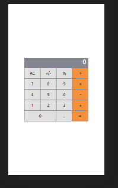

# Title
"Math magicians" is a website for all fans of mathematics. It is a Single Page App (SPA) that allows users to:

- Make simple calculations.
- Read a random math-related quote.
  

## Live demo
[math-magician](https://peterdgreat.github.io/math-magicians/)
## Built With

- React

- CSS

- Boostrap

- Visual Studio Code

- Git & Github

## Getting Started
To get a local copy up and running follow these simple example steps.

### Setup
* Open terminal
* Clone this project by command git clone(https://github.com/peterdgreat/math-magicians)
* Cd Todo-List

### install
Run the following command to have all npm packages dependencies installed:

npm install

### Usage

To start the webpack-dev-server, run the following command:

npm run start

## Authors

👤 **Ajayi Peter**

- GitHub: [@githubhandle](https://github.com/peterdgreat)
- Twitter: [@twitterhandle](https://twitter.com/dev_Peter_O)
- LinkedIn: [LinkedIn](https://linkedin.com/in/ajayi-peter-4391ab1b5)

## Show your support

Give a ⭐️ if you like this project!

## Acknowledgments
- Hat tip to anyone whose code was used
- Inspiration
- etc